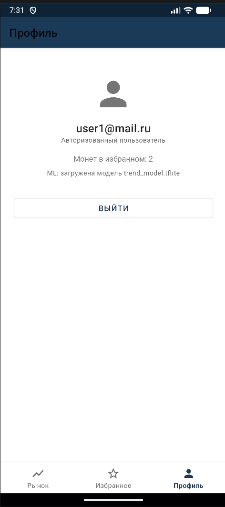
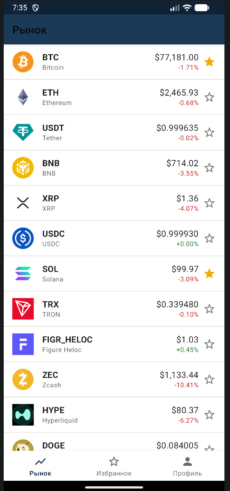
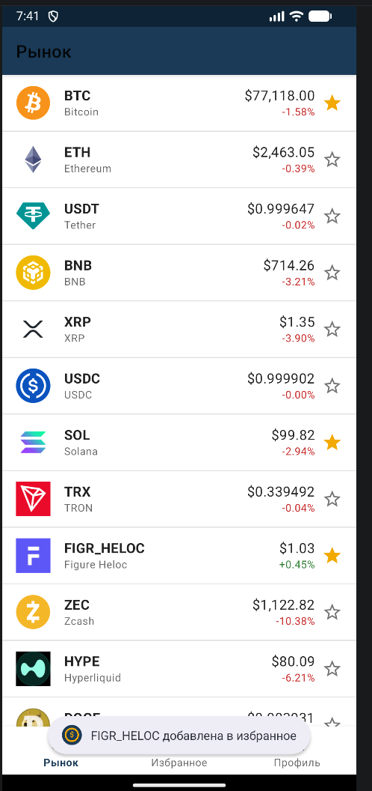
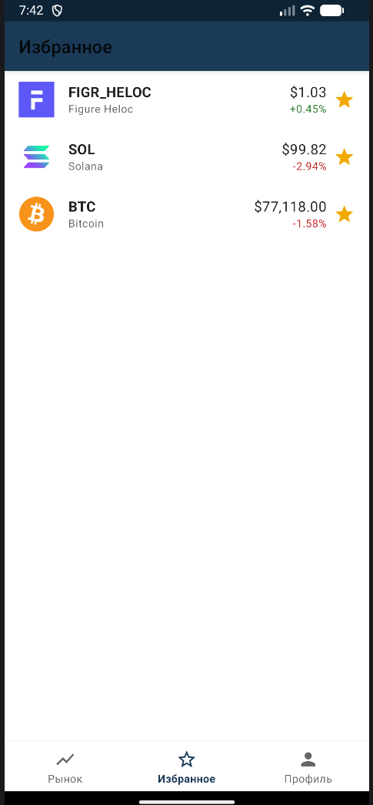
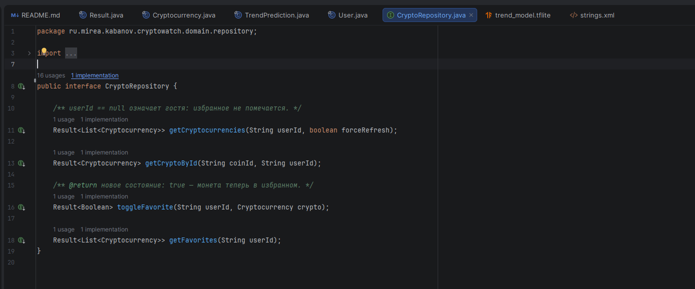
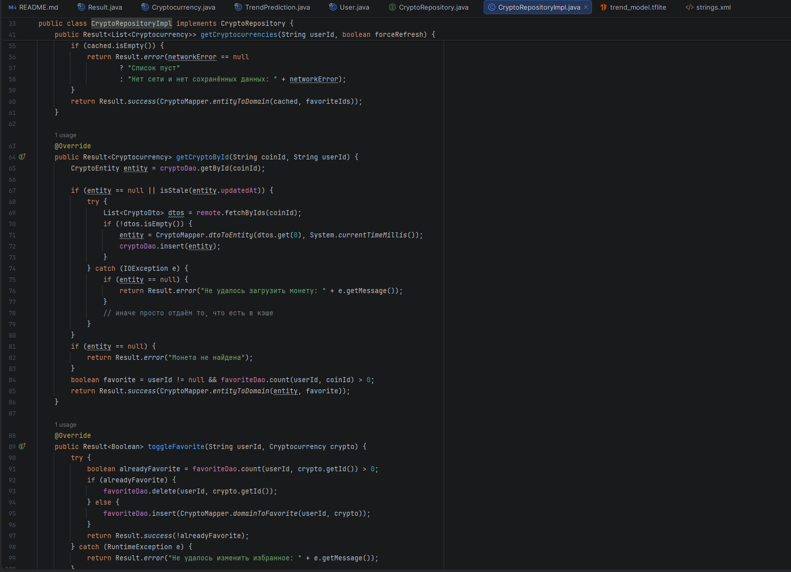

# CryptoWatch
kabanov_d_a biso-01-21

# CryptoWatch — трекер криптовалют (Android, Java)

Android приложение совмещающие принципы чистого кода и MVVM. Один
Activity, экраны — фрагменты, переходы через Navigation Component,
нижняя навигация из трёх вкладок.

### Полная структура пакетов

    cryptowatch
    ├── CryptoWatchApp.java              Application, инициализация DI
    ├── core
    │   ├── AppExecutors.java            пул фоновых потоков + main handler
    │   └── PriceFormatter.java          форматирование цен/процентов
    ├── di
    │   ├── ServiceLocator.java          ручной DI-контейнер
    │   └── ViewModelFactory.java        внедрение use case'ов во ViewModel
    ├── data
    │   ├── auth/FirebaseAuthDataSource.java
    │   ├── db/{AppDatabase, CryptoDao, CryptoEntity, FavoriteDao, FavoriteEntity}.java
    │   ├── mapper/{CryptoMapper, UserMapper}.java
    │   ├── ml/TrendClassifier.java      TensorFlow Lite Interpreter
    │   ├── model/{CryptoDto, UserDto}.java
    │   ├── network/{CoinGeckoApi, RetrofitProvider, CryptoRemoteDataSource}.java
    │   ├── repository/{CryptoRepositoryImpl, UserRepositoryImpl, TrendRepositoryImpl}.java
    │   └── storage/SharedPrefUserStorage.java
    ├── domain
    │   ├── common/Result.java
    │   ├── entity/{Cryptocurrency, User, TrendPrediction}.java
    │   ├── repository/{CryptoRepository, UserRepository, TrendRepository}.java
    │   └── usecase/  9 use case'ов + CredentialsValidator
    └── presentation
        ├── MainActivity.java            единственная Activity, хост навигации
        ├── list/{CryptoListFragment, CryptoListViewModel, CryptoAdapter, CryptoDetailArgs}.java
        ├── detail/{CryptoDetailFragment, CryptoDetailViewModel}.java
        ├── favorites/{FavoritesFragment, FavoritesViewModel}.java
        ├── auth/{LoginFragment, AuthViewModel}.java
        └── profile/{ProfileFragment, ProfileViewModel}.java

## 1. Как закрыты 7 обязательных требований

123

<table>
<colgroup>
<col style="width: 33%" />
<col style="width: 33%" />
<col style="width: 33%" />
</colgroup>
<thead>
<tr>
<th>#</th>
<th>Требование</th>
<th>Реализация</th>
</tr>
</thead>
<tbody>
<tr>
<td>1</td>
<td>Авторизация</td>
<td>Firebase Auth, e-mail/пароль, <code>FirebaseAuthDataSource</code> +
<code>LoginFragment</code></td>
</tr>
<tr>
<td>2</td>
<td>Внешний API</td>
<td>Retrofit + CoinGecko <code>GET /coins/markets</code> (топ-50,
sparkline за 7 дней)</td>
</tr>
<tr>
<td>3</td>
<td>БД</td>
<td>Room: таблица <code>cryptos</code> (кэш и офлайн) и
<code>favorites</code> (избранное, привязано к uid)</td>
</tr>
<tr>
<td>4</td>
<td>Список с изображениями</td>
<td>RecyclerView + ListAdapter/DiffUtil, картинки грузит Glide</td>
</tr>
<tr>
<td>5</td>
<td>Детальная страница</td>
<td><code>CryptoDetailFragment</code>, аргумент <code>coinId</code>,
свой back stack</td>
</tr>
<tr>
<td>6</td>
<td>Гость vs авторизованный</td>
<td>Разные состояния экранов + проверки в use case’ах</td>
</tr>
<tr>
<td>7</td>
<td>TFLite</td>
<td><code>TrendClassifier</code>: 7 признаков → 3 класса (рост / боковик
/ падение)</td>
</tr>
</tbody>
</table>

------------------------------------------------------------------------

## 2. Слои и зависимости

    presentation  →  domain  ←  data
       (UI)          (ядро)     (источники)

<table>
<colgroup>
<col style="width: 25%" />
<col style="width: 25%" />
<col style="width: 25%" />
<col style="width: 25%" />
</colgroup>
<thead>
<tr>
<th>Слой</th>
<th>Пакет</th>
<th>Что внутри</th>
<th>От чего зависит</th>
</tr>
</thead>
<tbody>
<tr>
<td>domain</td>
<td><code>domain/</code></td>
<td><code>Cryptocurrency</code>, <code>User</code>,
<code>TrendPrediction</code>, <code>Result</code>, интерфейсы
репозиториев, 9 use case’ов</td>
<td>ни от чего</td>
</tr>
<tr>
<td>data</td>
<td><code>data/</code></td>
<td>Retrofit + CoinGecko, Room, Firebase Auth, SharedPreferences,
TFLite, мапперы, реализации репозиториев</td>
<td>domain</td>
</tr>
<tr>
<td>presentation</td>
<td><code>presentation/</code></td>
<td>MainActivity, 5 фрагментов, 5 ViewModel,
<code>CryptoAdapter</code></td>
<td>domain (через use case’ы)</td>
</tr>
<tr>
<td>di</td>
<td><code>di/</code></td>
<td><code>ServiceLocator</code> (сборка графа),
<code>ViewModelFactory</code></td>
<td>всё</td>
</tr>
</tbody>
</table>

Инверсия зависимостей: `CryptoRepository` — интерфейс в
`domain/repository`, реализация `CryptoRepositoryImpl` — в
`data/repository`. Domain знает контракт, но не знает, что за ним стоит
сеть и БД. Заменить CoinGecko на другой API можно, не тронув ни одного
класса выше data-слоя.

------------------------------------------------------------------------

## 3. Акторы и use cases

<table>
<colgroup>
<col style="width: 24%" />
<col style="width: 26%" />
<col style="width: 24%" />
<col style="width: 24%" />
</colgroup>
<thead>
<tr>
<th>Use case</th>
<th>Класс</th>
<th style="text-align: center;">Guest</th>
<th style="text-align: center;">AuthUser</th>
</tr>
</thead>
<tbody>
<tr>
<td>Просмотр списка монет</td>
<td><code>GetCryptocurrenciesUseCase</code></td>
<td style="text-align: center;">✅</td>
<td style="text-align: center;">✅ (+ отметки избранного)</td>
</tr>
<tr>
<td>Детальная страница</td>
<td><code>GetCryptoByIdUseCase</code></td>
<td style="text-align: center;">✅</td>
<td style="text-align: center;">✅</td>
</tr>
<tr>
<td>Вход</td>
<td><code>LoginUseCase</code></td>
<td style="text-align: center;">✅</td>
<td style="text-align: center;">—</td>
</tr>
<tr>
<td>Регистрация</td>
<td><code>RegisterUseCase</code></td>
<td style="text-align: center;">✅</td>
<td style="text-align: center;">—</td>
</tr>
<tr>
<td>Выход</td>
<td><code>LogoutUseCase</code></td>
<td style="text-align: center;">—</td>
<td style="text-align: center;">✅</td>
</tr>
<tr>
<td>Добавить/убрать избранное</td>
<td><code>ToggleFavoriteUseCase</code></td>
<td style="text-align: center;">❌</td>
<td style="text-align: center;">✅</td>
</tr>
<tr>
<td>Список избранного</td>
<td><code>GetFavoriteCryptosUseCase</code></td>
<td style="text-align: center;">❌</td>
<td style="text-align: center;">✅</td>
</tr>
<tr>
<td>Профиль</td>
<td><code>GetCurrentUserUseCase</code></td>
<td style="text-align: center;">✅ (как «Гость»)</td>
<td style="text-align: center;">✅</td>
</tr>
<tr>
<td>Распознавание тренда (ML)</td>
<td><code>PredictTrendUseCase</code></td>
<td style="text-align: center;">❌</td>
<td style="text-align: center;">✅</td>
</tr>
</tbody>
</table>

## 4. Скриншоты работы приложения

Экран регистрации (уже зарегистрированы).

Список доступных монет.

Список избранных монет. Добавление в избранное.

## 5. Требования к `"Чистой Архитектуре"`

### 5.1 Главное правило Clean Architecture — зависимости направлены внутрь, к бизнес-логике.

    presentation  →  domain  ←  data
       (UI)          (ядро)     (источники)

### 5.2 Инверсия зависимостей

`CryptoRepository` — интерфейс в domain/repository.
`CryptoRepositoryImpl` — реализация в data/repository.

То есть domain знает контракт, но не знает, что за ним стоит: Retrofit,
Room, Firebase или mock. Это и есть инверсия зависимостей. Можно
заменить CoinGecko на другой API, не тронув ни одного класса выше
data-слоя.

### 5.3 Use case’ы как отдельные сценарии

<table>
<colgroup>
<col style="width: 20%" />
<col style="width: 20%" />
<col style="width: 20%" />
<col style="width: 20%" />
<col style="width: 20%" />
</colgroup>
<thead>
<tr>
<th>#</th>
<th>Use case</th>
<th>Актор</th>
<th>Что делает</th>
<th>Проверки / особенность</th>
</tr>
</thead>
<tbody>
<tr>
<td>UC-1</td>
<td><code>GetCryptocurrenciesUseCase</code></td>
<td>Guest + Auth</td>
<td>Список топ-50 монет</td>
<td>При <code>userId != null</code> — с отметками избранного; офлайн —
из Room</td>
</tr>
<tr>
<td>UC-2</td>
<td><code>GetCryptoByIdUseCase</code></td>
<td>Guest + Auth</td>
<td>Детальная страница монеты</td>
<td><code>coinId</code> пустой → ошибка</td>
</tr>
<tr>
<td>UC-3</td>
<td><code>ToggleFavoriteUseCase</code></td>
<td>только Auth</td>
<td>Добавить/убрать избранное</td>
<td><code>userId == null</code> → проверка <strong>здесь, не в
UI</strong></td>
</tr>
<tr>
<td>UC-4</td>
<td><code>GetFavoriteCryptosUseCase</code></td>
<td>только Auth</td>
<td>Список избранного</td>
<td><code>userId == null</code> → ошибка; избранное привязано к
<code>uid</code></td>
</tr>
<tr>
<td>UC-5</td>
<td><code>LoginUseCase</code></td>
<td>Guest</td>
<td>Вход</td>
<td></td>
</tr>
<tr>
<td>UC-6</td>
<td><code>RegisterUseCase</code></td>
<td>Guest</td>
<td>Регистрация</td>
<td></td>
</tr>
<tr>
<td>UC-7</td>
<td><code>LogoutUseCase</code></td>
<td>Auth</td>
<td>Выход</td>
<td></td>
</tr>
<tr>
<td>UC-8</td>
<td><code>GetCurrentUserUseCase</code></td>
<td>любой</td>
<td>Кто сейчас: Guest или Auth</td>
<td></td>
</tr>
<tr>
<td>UC-9</td>
<td><code>PredictTrendUseCase</code></td>
<td>только Auth</td>
<td>ML-прогноз тренда</td>
<td></td>
</tr>
</tbody>
</table>

## 6. Качества MVVM

### 6.1 Разделение ролей

- View — MainActivity, 5 фрагментов, CryptoAdapter. Они только
  отрисовывают состояние и передают действия пользователя во ViewModel.

- ViewModel — CryptoListViewModel, CryptoDetailViewModel,
  FavoritesViewModel, AuthViewModel, ProfileViewModel. Они хранят
  UI-состояние, вызывают use case’ы и отдают результат через LiveData.

- Model — domain + data: сущности, use case’ы, репозитории, источники
  данных.

UI-логика отделена от бизнес-логики
